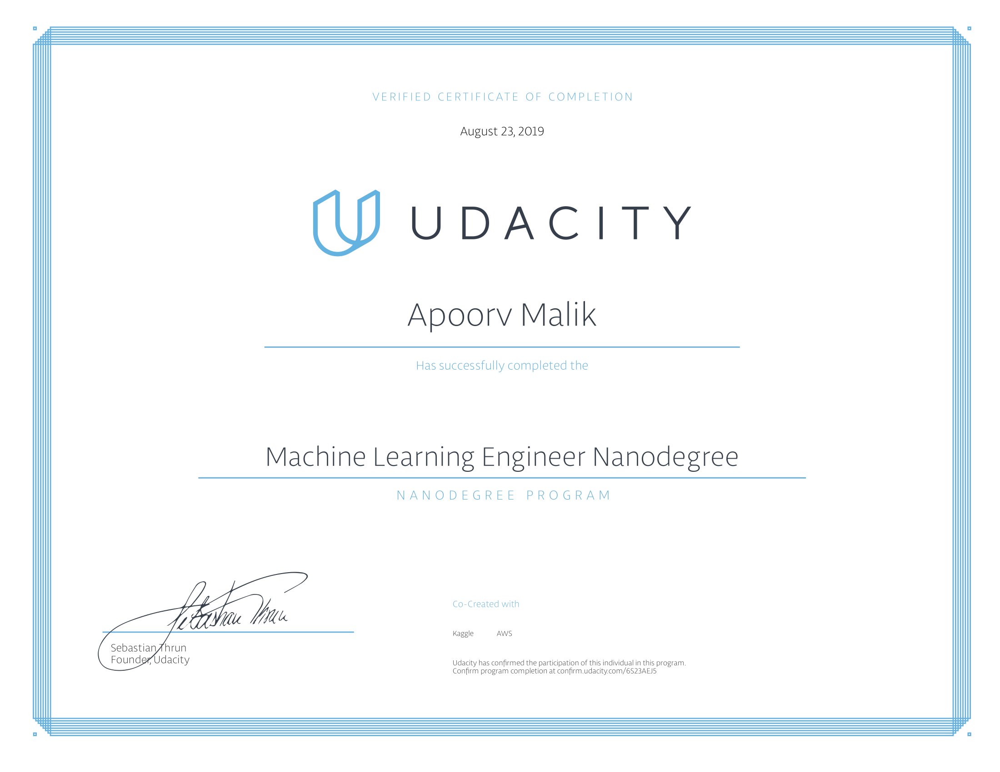
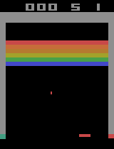

# Udacity Machine Learning Engineer Nanodegree Capstone Project

This repository contains the final capstone project for the [Udacity Machine Learning Engineer Nanodegree](https://www.udacity.com/course/machine-learning-engineer-nanodegree--nd009t) program.

In this project we have trained a Deep Neural Network to play the classic game Atari Breakout. The neural network model is trained with the help of DQN algorithm.

The jupyter notebook [Breakout DQN](Breakout%20DQN) contains the training process and the model's evaluation.

The links to the proposal and report of the final
project are below.

- [The project proposal: Project Proposal/Proposal.pdf](Project%20Proposal/proposal.pdf)
- [The final project report: Project Report/report.pdf](Project%20Report/report.pdf)

Run this code in the terminal to open the jupyter notebook containing the project:

`jupyter notebook Breakout\ DQN.ipynb`

Alternatively, you can view the HTML version of this notebook here: [Breakout DQN.html](Breakout%20DQN.html)

## Certificate

[Verification link](https://confirm.udacity.com/6S23AEJ5)

## Directory Description

- The folder [Models](Models/) contains the python implementation of the DQN algorithm and the Deep Neural Network.
- The folder [Gifs](Gifs/) contains the gifs of various agents playing this game.
- The folder [Weights](Weights/) contains the weights of the model, during multiple training sessions.
- The folder [Logs](Logs/) contains the scores achieved by the model, during multiple training sessions.
- The folder [Utility](Utility/) contains various utility programs for the project.

## Watch a random agent play this game.

## Watch a fully trained DQN agent play this game.

## Requirements

Following [libraries requirement](/requirements.txt) are necessary for this project. Run the code below in the terminal to install these requirements:

`pip install -r requirements.txt`

## Libraries Used

- [Numpy](https://www.numpy.org/): NumPy is a very popular python library for large multi-dimensional array and matrix processing, with the help of a large collection of high-level mathematical functions. It is very useful for fundamental scientific computations in Machine Learning. It is particularly useful for linear algebra, Fourier transform, and random number capabilities. High-end libraries like TensorFlow uses NumPy internally for manipulation of Tensors.

- [Pandas](https://pandas.pydata.org/): Pandas is a popular Python library for data analysis. It is not directly related to Machine Learning. As we know that the dataset must be prepared before training. In this case, Pandas comes handy as it was developed specifically for data extraction and preparation. It provides high-level data structures and wide variety tools for data analysis. It provides many inbuilt methods for groping, combining and filtering data.

- [Matplotlib](https://matplotlib.org/): Matpoltlib is a very popular Python library for data visualization. Like Pandas, it is not directly related to Machine Learning. It particularly comes in handy when a programmer wants to visualize the patterns in the data. It is a 2D plotting library used for creating 2D graphs and plots. A module named pyplot makes it easy for programmers for plotting as it provides features to control line styles, font properties, formatting axes, etc. It provides various kinds of graphs and plots for data visualization, viz., histogram, error charts, bar chats, etc.

- [Tensorflow](https://www.tensorflow.org/): TensorFlow is a very popular open-source library for high performance numerical computation developed by the Google Brain team in Google. As the name suggests, Tensorflow is a framework that involves defining and running computations involving tensors. It can train and run deep neural networks that can be used to develop several AI applications. TensorFlow is widely used in the field of deep learning research and application.

- [Keras](https://keras.io/): Keras is a very popular Machine Learning library for Python. It is a high-level neural networks API capable of running on top of TensorFlow, CNTK, or Theano. It can run seamlessly on both CPU and GPU. Keras makes it really for ML beginners to build and design a Neural Network. One of the best thing about Keras is that it allows for easy and fast prototyping.

## Author

[Apoorv Malik](https://github.com/1998apoorvmalik)
